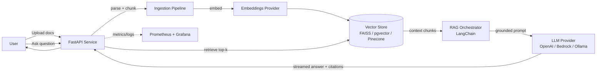

# DocRAG — Document Intelligence Platform (RAG)

> **Purpose:** A portfolio-grade, production-style Retrieval-Augmented Generation (RAG) application that mirrors the GenAI work on my resume (Cigna document-summarization / semantic-search pipeline) **without any proprietary data**. Built to prove end-to-end GenAI engineering depth for AI/ML, GenAI, and Backend/Distributed-Systems roles (FAANG, Reddit, Discord, etc.).

This document is the **build spec**. Hand it to a coding agent (Opus 4.8) to implement, then push to GitHub and link it on the resume.

---

## 1. Elevator Pitch (what it does)

DocRAG lets a user upload documents (PDF / TXT / Markdown), automatically **ingests → chunks → embeds → indexes** them into a vector store, and then answer natural-language questions over them with an LLM. Every answer is **grounded with citations** back to the source chunks, and the system ships with a **retrieval-quality evaluation harness** so quality is measurable — not just a demo.

This is intentionally the same shape as the production RAG pipeline described on the resume (100K docs/day ingestion, semantic search over millions of records), scaled down to a runnable open-source repo.

---

## 2. Why This Project (resume alignment)

| Resume claim | How this project proves it |
|---|---|
| "RAG pipeline using LangChain + Bedrock" | Core architecture below |
| "Pinecone vector DB + embeddings, semantic search" | Pluggable vector store (FAISS local / pgvector / Pinecone) |
| "~100K docs/day ingestion" | Batch + async ingestion pipeline with a load-test script |
| "p99 latency, observability, 99.99% uptime" | Metrics, structured logging, health checks |
| "Microservices, event-driven, CI/CD" | FastAPI service + Docker + GitHub Actions + optional queue |
| "Senior/Staff SWE" | Clean architecture, tests, eval harness, docs |

---

## 3. Core Features (MVP → Stretch)

### MVP (must-have — this is enough for the resume)
- [ ] Upload PDF / TXT / Markdown via API and/or UI
- [ ] Document parsing + text extraction
- [ ] Configurable **chunking** (size + overlap, token-aware)
- [ ] **Embeddings** generation (swappable provider)
- [ ] **Vector store** indexing + similarity search
- [ ] **RAG query** endpoint: retrieve top-k → build prompt → LLM answer
- [ ] **Citations**: every answer cites source filename + chunk
- [ ] Streaming responses (token-by-token)
- [ ] Simple web UI (upload + chat)
- [ ] `.env`-based config, no secrets committed
- [ ] README with architecture diagram + screenshots

### Stretch (pick 2–3 to stand out)
- [ ] **Reranking** (cross-encoder / Cohere rerank) after vector retrieval
- [ ] **Hybrid search** (BM25 keyword + vector, fused with RRF)
- [ ] **Evaluation harness**: retrieval precision/recall, faithfulness, answer relevancy (RAGAS)
- [ ] **Async ingestion** via a queue (Redis/RQ or SQS-style) to simulate 100K docs/day
- [ ] **Observability**: Prometheus metrics + Grafana dashboard (latency p50/p95/p99, tokens, cost)
- [ ] **Multi-tenant** namespaces (per-user collections)
- [ ] **Guardrails**: PII redaction on ingest, prompt-injection filtering
- [ ] **Caching** of embeddings + query results (Redis)
- [ ] Conversation memory (multi-turn chat with history)

---

## 4. Recommended Tech Stack

> Designed to **match the resume keywords** while staying free/low-cost to run.

### Language & Core
- **Python 3.11+** (primary — matches GenAI work)
- **LangChain** (orchestration) — or **LlamaIndex** as alternative
- **FastAPI** (async REST API service)
- **Pydantic** (config + schema validation)
- **Uvicorn** (ASGI server)

### LLM Providers (make it swappable via interface)
- **OpenAI** (`gpt-4o-mini` — cheap, great for dev) — default
- **AWS Bedrock** (Claude / Titan) — matches resume; optional via flag
- **Ollama** (local Llama 3 / Mistral) — zero-cost offline mode

### Embeddings (swappable)
- `text-embedding-3-small` (OpenAI) — default, cheap
- **AWS Titan embeddings** — matches resume
- `sentence-transformers` (local, free) — offline mode

### Vector Store (pluggable — implement an interface, ship 2)
- **FAISS** (local, zero-cost) — default for the repo so anyone can run it
- **pgvector** (Postgres) — production-style, matches "distributed data storage"
- **Pinecone** (managed) — matches resume exactly; optional via env

### Frontend (keep it light)
- **Streamlit** (fastest to build, good for demo) — recommended
- *or* **React + Vite + Tailwind** (if you want full-stack signal)

### Infra / DevOps (this is what makes it look senior)
- **Docker** + **docker-compose** (app + Postgres/pgvector + Redis)
- **GitHub Actions** CI: lint (ruff), type-check (mypy), tests (pytest), build image
- **Makefile** for common commands
- **Prometheus + Grafana** (stretch) for the observability story

### Testing & Quality
- **pytest** + **pytest-asyncio**
- **ruff** (lint) + **black** (format) + **mypy** (types)
- **RAGAS** (stretch — RAG eval metrics)

---

## 5. Architecture



### Ingestion flow
1. Receive file → detect type → extract text (`pypdf`, plain read)
2. Clean + normalize text
3. Token-aware chunking (size ~500–800 tokens, overlap ~10–15%)
4. Generate embeddings (batched)
5. Upsert into vector store with metadata (`source`, `chunk_id`, `page`)

### Query flow
1. Embed the query
2. Vector similarity search (top-k, e.g. k=5)
3. *(stretch)* rerank / hybrid-fuse
4. Assemble grounded prompt with retrieved context + citation markers
5. Stream LLM answer with inline `[source: file.pdf #chunk]` citations

---

## 6. Suggested Repository Structure

```
docrag/
├── README.md                  # pitch, architecture diagram, screenshots, quickstart
├── LICENSE                    # MIT
├── .env.example               # documented config, NO real keys
├── .gitignore
├── Makefile
├── pyproject.toml             # deps + tool config (ruff/black/mypy/pytest)
├── docker-compose.yml         # app + postgres(pgvector) + redis + grafana
├── Dockerfile
├── .github/
│   └── workflows/ci.yml       # lint, type-check, test, docker build
├── docs/
│   └── architecture.png
├── src/
│   └── docrag/
│       ├── __init__.py
│       ├── config.py          # pydantic settings from env
│       ├── api/
│       │   ├── main.py        # FastAPI app, routes, streaming
│       │   └── schemas.py
│       ├── ingestion/
│       │   ├── loaders.py     # pdf/txt/md parsing
│       │   └── chunker.py     # token-aware chunking
│       ├── embeddings/
│       │   ├── base.py        # Embeddings interface
│       │   ├── openai.py
│       │   ├── bedrock.py
│       │   └── local.py       # sentence-transformers
│       ├── vectorstore/
│       │   ├── base.py        # VectorStore interface
│       │   ├── faiss_store.py
│       │   ├── pgvector_store.py
│       │   └── pinecone_store.py
│       ├── rag/
│       │   ├── retriever.py   # top-k, hybrid, rerank
│       │   ├── prompt.py      # grounded prompt + citations
│       │   └── pipeline.py    # orchestration (LangChain)
│       ├── llm/
│       │   ├── base.py        # LLM interface
│       │   ├── openai.py
│       │   ├── bedrock.py
│       │   └── ollama.py
│       └── observability/
│           ├── logging.py     # structured JSON logs
│           └── metrics.py     # Prometheus counters/histograms
├── ui/
│   └── app.py                 # Streamlit (or React app/ folder)
├── scripts/
│   └── load_test.py           # simulate high-volume ingestion (the "100K/day" story)
└── tests/
    ├── test_chunker.py
    ├── test_retriever.py
    ├── test_pipeline.py
    └── test_api.py
```

---

## 7. Key Design Principles (call these out in the README — they signal seniority)

1. **Provider-agnostic interfaces** — `Embeddings`, `VectorStore`, `LLM` are abstract base classes; concrete implementations are swapped via config. (Shows clean architecture / dependency inversion.)
2. **Runs out-of-the-box for free** — default config = FAISS + sentence-transformers + Ollama, so any reviewer can `make run` with zero API keys.
3. **Measurable quality** — eval harness with real metrics, not vibes.
4. **Observable** — structured logs + latency histograms (p50/p95/p99) + token/cost tracking.
5. **Secure by default** — secrets only via env, `.env` gitignored, optional PII redaction on ingest, no proprietary data ever.
6. **Tested + CI-gated** — PRs must pass lint/type/test before merge.

---

## 8. README Must-Haves (recruiters read the README, not the code)

- One-paragraph pitch + a GIF/screenshot of the chat with citations
- Architecture diagram (the Mermaid above, rendered to PNG)
- **Quickstart** (3 commands: clone, `cp .env.example .env`, `make run`)
- Tech stack badges
- "Design decisions" section (the principles above)
- **Eval results** table (retrieval precision, faithfulness) — even small numbers
- "Production notes" — how this maps to a 100K-docs/day system (scaling, queues, caching)
- Roadmap / stretch items

---

## 9. Resume Line (what to add once it's on GitHub)

Add a **Projects** section to `Sai-Kiran-resume.tex`:

```latex
\section{Projects}
\resumeSubHeadingListStart
\resumeSubItem{DocRAG — Document Intelligence Platform}
{Open-source RAG application (\textbf{Python, FastAPI, LangChain}) with pluggable vector stores
(\textbf{FAISS / pgvector / Pinecone}) and LLM providers (\textbf{OpenAI / AWS Bedrock / Ollama});
features token-aware chunking, citation-grounded answers, hybrid search + reranking, a RAGAS
evaluation harness, and Prometheus/Grafana observability. Containerized with Docker and CI-gated
via GitHub Actions. \href{https://github.com/<your-handle>/docrag}{github.com/<your-handle>/docrag}}
\resumeSubHeadingListEnd
```

*(Trim the tech list to whatever you actually implement. Keep it honest.)*

---

## 10. Build Order (for the agent)

1. Scaffold repo + `pyproject.toml` + tooling + CI skeleton
2. Config (`config.py`) + interfaces (`base.py` for embeddings/vectorstore/llm)
3. Ingestion (loaders + chunker) + tests
4. Local defaults first: FAISS store + sentence-transformers embeddings + Ollama LLM
5. RAG pipeline (retriever → prompt → LLM) with streaming + citations
6. FastAPI endpoints (`/ingest`, `/query`, `/health`)
7. Streamlit UI
8. Docker + docker-compose + README
9. Add cloud providers (OpenAI, Bedrock, Pinecone, pgvector)
10. Stretch: eval harness, reranking, hybrid search, observability, load-test script

---

## 11. Honesty Guardrails (important)

- Only put technologies on the resume that you **actually implement** here.
- The eval numbers in the README must be **real outputs** from your runs.
- This project is your own work on **public/synthetic data** — never include anything from Cigna/Kaiser/Thinqspot.
- When asked in interviews, you can confidently say: *"I built this to demonstrate the same RAG architecture I work on professionally, on open data."*

---

**Next:** Build with Opus 4.8 → push to GitHub → send me the repo link → I'll wire the Projects section into the resume with the real tech list and live URL.
