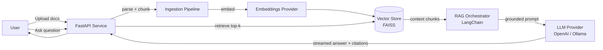

# DocRAG — Document Intelligence Platform (RAG)

> A portfolio-grade, production-style **Retrieval-Augmented Generation** service.
> Upload documents (PDF / TXT / Markdown) and DocRAG **ingests → chunks → embeds →
> indexes** them, then answers natural-language questions with an LLM — every
> answer **grounded with inline citations** back to the source chunks.

[](https://www.python.org/)
[](https://fastapi.tiangolo.com/)
[](https://www.langchain.com/)
[](https://github.com/facebookresearch/faiss)
[](LICENSE)

DocRAG is **provider-agnostic** (`Embeddings`, `VectorStore`, and `LLM` are
abstract interfaces) and **runs for free on a CPU** — no GPU and no API keys
required for the default local stack.

---

## Highlights

- 🔌 **Swappable providers** via one env var — local *or* cloud, no code changes.
- 📑 **Citation-grounded answers** — every claim cites `[source: file #chunk]`.
- 🌊 **Token streaming** — answers stream over NDJSON to the API and UI.
- 🧱 **Token-aware chunking** — `tiktoken` sliding window with page-accurate metadata.
- 🧪 **Tested** — `pytest` suite with fully offline fakes; `ruff` + `mypy` clean.
- 🖥️ **Runs on a laptop** — 32 GB RAM, **no GPU** needed (see below).

---

## Do I need a GPU?

**No.** Everything except local LLM *generation* is comfortably CPU-bound:

| Component | Hardware | Notes |
|---|---|---|
| Embeddings (`all-MiniLM-L6-v2`) | CPU | 384-dim, fast on a laptop |
| Vector search (FAISS) | CPU | `faiss-cpu`, flat inner-product index |
| Ingestion / API / chunking | CPU | no GPU relevance |
| Local LLM generation (Ollama) | CPU (slow) / GPU (fast) | small quantized models give ~5–15 tok/s on CPU |

If local generation feels slow, flip the LLM provider to **OpenAI `gpt-4o-mini`**
(cheap, fast, no hardware) while keeping embeddings local and free.

---

## Quickstart

```bash
make venv          # create the virtual environment (.venv)
make install       # CPU-only torch + project (editable) with dev tools
cp .env.example .env
make run           # FastAPI at http://localhost:8000  (interactive docs at /docs)
make ui            # Streamlit UI at http://localhost:8501  (in a second terminal)
```

The default config (`local` embeddings + `faiss` + `ollama`) needs **no API keys**.

### Choosing an LLM backend

**Option A — Local & free (Ollama).** Install Ollama and pull a small model:

```bash
# https://ollama.com/download  (works in WSL or on the Windows host)
ollama pull llama3.2:3b
ollama serve         # serves http://localhost:11434
```

> **WSL note:** run Ollama inside WSL, or point `DOCRAG_OLLAMA_BASE_URL` at the
> Windows host if you run Ollama there.

**Option B — Fast & cheap (OpenAI).** In `.env`:

```ini
DOCRAG_LLM_PROVIDER=openai
DOCRAG_EMBEDDINGS_PROVIDER=openai   # optional; local embeddings stay free
OPENAI_API_KEY=sk-...
```

---

## Architecture



**Ingestion:** detect type → extract text (per-page for PDF) → normalize →
token-aware chunk → embed (batched) → upsert into the vector store with
`source` / `chunk_id` / `page` metadata.

**Query:** embed the question → top-k similarity search → assemble a grounded,
citation-annotated prompt → stream the LLM answer with inline citations.

---

## API

| Method | Path | Description |
|---|---|---|
| `GET`  | `/health` | Liveness, configured providers, indexed chunk count |
| `POST` | `/ingest` | Multipart upload of a PDF/TXT/MD file to index |
| `POST` | `/query`  | Ask a question; NDJSON token stream (or JSON when `stream=false`) |

```bash
# Ingest a document
curl -X POST http://localhost:8000/ingest \
  -F "file=@data/sample/nimbus-faq.md;type=text/markdown"

# Ask a question (non-streaming JSON)
curl -X POST http://localhost:8000/query \
  -H "Content-Type: application/json" \
  -d '{"question":"How long are raw events retained?","stream":false}'
```

The streaming response emits one `sources` event (citations), then `token`
events, then a final `done` event (or an `error` event if generation fails).

---

## Configuration

All settings use the `DOCRAG_` prefix and can live in `.env` (see
[.env.example](.env.example)).

| Variable | Default | Description |
|---|---|---|
| `DOCRAG_EMBEDDINGS_PROVIDER` | `local` | `local` (sentence-transformers) or `openai` |
| `DOCRAG_LLM_PROVIDER` | `ollama` | `ollama` (local) or `openai` |
| `DOCRAG_VECTORSTORE_PROVIDER` | `faiss` | local FAISS index |
| `DOCRAG_CHUNK_SIZE` / `DOCRAG_CHUNK_OVERLAP` | `600` / `80` | token-aware chunking |
| `DOCRAG_TOP_K` | `5` | chunks retrieved per query |
| `OPENAI_API_KEY` | — | required only when a provider is `openai` |

---

## Design Principles

1. **Provider-agnostic interfaces** — `Embeddings`, `VectorStore`, and `LLM` are
   ABCs; concrete backends are wired in a single composition root
   ([factory.py](src/docrag/factory.py)). Dependency inversion, not vendor lock-in.
2. **Runs free out-of-the-box** — FAISS + sentence-transformers + Ollama require
   no API keys, so any reviewer can run it on a laptop.
3. **Grounded & cited** — the prompt forbids outside knowledge and requires
   inline citations; unsupported questions get an honest "I don't know".
4. **Observable** — structured JSON logs plus Prometheus metrics (`/metrics`):
   per-route latency histograms (p50/p95/p99), query/ingest durations, retrieved
   chunks, and answer-token counters, with a ready-made Grafana dashboard.
5. **Secure by default** — secrets only via env, `.env` is gitignored, and the
   project is built and tested exclusively on public/synthetic data.

---

## Project Layout

```
src/docrag/
├── config.py            # pydantic-settings; provider enums
├── factory.py           # composition root: settings -> concrete providers
├── models.py            # Chunk / ScoredChunk / Citation
├── api/                 # FastAPI app, schemas, DI container
├── ingestion/           # loaders (pdf/txt/md) + token-aware chunker + service
├── embeddings/          # Embeddings ABC + local + openai
├── vectorstore/         # VectorStore ABC + FAISS
├── llm/                 # LLM ABC + ollama + openai
├── rag/                 # retriever, grounded prompt, streaming pipeline
└── observability/       # structured logging
ui/app.py                # Streamlit chat UI
data/sample/             # synthetic documents for local testing
tests/                   # pytest suite (offline fakes)
```

---

## Development

```bash
make test    # pytest
make lint    # ruff + mypy
make fmt     # black + ruff --fix
make eval    # retrieval-quality evaluation over the gold dataset
```

---

## Evaluation

DocRAG ships a measurable eval harness, not just a demo. The **retrieval** metrics
below are real outputs of `make eval` (dense retrieval with the local
`all-MiniLM-L6-v2` embeddings) over a gold question set
([data/eval/qa.json](data/eval/qa.json)) of 10 questions against the synthetic
sample corpus (11 chunks). They require **no LLM** and reproduce on any CPU:

| k | Hit@k | Recall@k | Precision@k |
|---|------:|---------:|------------:|
| 1 | 0.90 | 0.75 | 0.90 |
| 3 | 1.00 | 1.00 | 0.77 |
| 5 | 1.00 | 1.00 | 0.58 |

**MRR: 0.950** — 9 of 10 questions retrieve the correct source as the very top result.

> **Generation metrics** (RAGAS faithfulness / answer relevancy / context precision)
> require a configured LLM: `pip install -e ".[eval]"` then `python scripts/eval.py --ragas`.

Retrieval quality can be improved further with **hybrid search** and **reranking**
(both implemented — enable `DOCRAG_HYBRID_SEARCH=true` / `DOCRAG_RERANK=true`).

---

## Roadmap

These build on the same interfaces without breaking the MVP:

- [x] **Hybrid search** — BM25 + vector fused with Reciprocal Rank Fusion
- [x] **Reranking** — cross-encoder reorder of retrieved candidates
- [x] **Evaluation harness** — retrieval metrics now; RAGAS generation metrics via `--ragas`
- [x] **Observability** — Prometheus metrics (p50/p95/p99, tokens) + Grafana dashboard
- [ ] **Docker + CI** — `docker-compose` stack and GitHub Actions (lint/type/test/build)
- [ ] **More stores/providers** — pgvector, Pinecone, AWS Bedrock

---

## A note on data & honesty

DocRAG is built on **public/synthetic data only** (see [data/sample](data/sample)).
It mirrors the *architecture* of a production RAG system without any proprietary
content. All evaluation numbers published here are real outputs from local runs.

## License

MIT — see [LICENSE](LICENSE).
